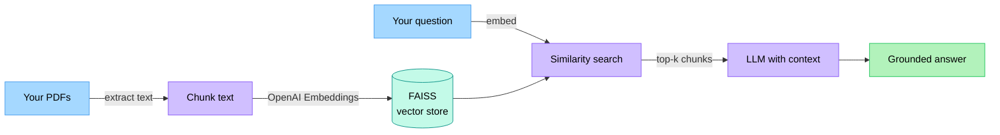

<!--
  Banner generated by capsule-render. Tweak via the URL parameters.
  https://capsule-render.vercel.app/api
-->
<p align="center">
  
</p>

<p align="center">
  
  
  
  
  
  
  
  
</p>

<p align="center">
  <b>A RAG chatbot that answers questions from your own PDFs.</b><br/>
  Upload a file, ask anything, get a grounded answer based on the document, not the model's training data.
</p>

<p align="center">
  
</p>

---

## Why it exists

Most AI assistants are *well-read strangers*. They know the internet, not your data.
QueryPDF demonstrates the pattern that fixes this: **ground the LLM in the user's own documents through retrieval-augmented generation**, so answers come from the source material rather than the model's training data.

---

## How it works



**The flow:**

1. **Upload PDFs.** The app extracts text from each file.
2. **Chunk and embed.** Text is split with `CharacterTextSplitter`, then each chunk is converted to a vector with OpenAI Embeddings.
3. **Index in FAISS.** Vectors go into a local FAISS index for fast similarity search.
4. **Query.** A question is embedded, FAISS returns the top-k most relevant chunks, and those chunks become context for the LLM.
5. **Answer.** The LLM responds using only the retrieved context. Conversation memory keeps follow-ups coherent.

---

## Tech stack

| Layer | Tool |
|---|---|
| UI | Streamlit |
| Orchestration | LangChain |
| Embeddings | OpenAI Embeddings |
| Vector store | FAISS (local, in-memory) |
| Container | Docker |

---

## Quick start

> Requires Docker and an OpenAI API key.

```bash
# 1. Clone
git clone https://github.com/19bk/QueryPDF_using_AI.git
cd QueryPDF_using_AI

# 2. Set your API key
cp .env.example .env
# Edit .env and set OPENAI_API_KEY

# 3. Build and run
docker build -t pdf-query-chatbot .
docker run --env-file .env -p 8501:8501 pdf-query-chatbot
```

Open <http://localhost:8501> and start asking your documents questions.

---

## Project structure

```
QueryPDF_using_AI/
├── src/              # Application source
├── static/           # README screenshots
├── Dockerfile        # Container build
├── requirements.txt  # Python dependencies
├── .env.example      # Environment template
└── README.md
```

---

## When to use this pattern

RAG is the right approach when:

- The answers need to come from documents you control (policies, manuals, SOPs, contracts).
- The data changes too often to fine-tune a model on.
- You need source citations alongside answers.
- The model must not invent information that is not in the source material.

---

## Screenshots

<p align="center">
  
</p>

---

## License

MIT. See [LICENSE](LICENSE).

---

<p align="center">
  Built by <a href="https://github.com/19bk">Bernard Kibathi</a> — AI &amp; Automation Engineer<br/>
  <a href="https://dev.to/bernardkibathi">Dev.to</a> ·
  <a href="https://linkedin.com/in/bernard-kibathi">LinkedIn</a> ·
  <a href="https://github.com/19bk">GitHub</a>
</p>

<p align="center">
  
</p>
