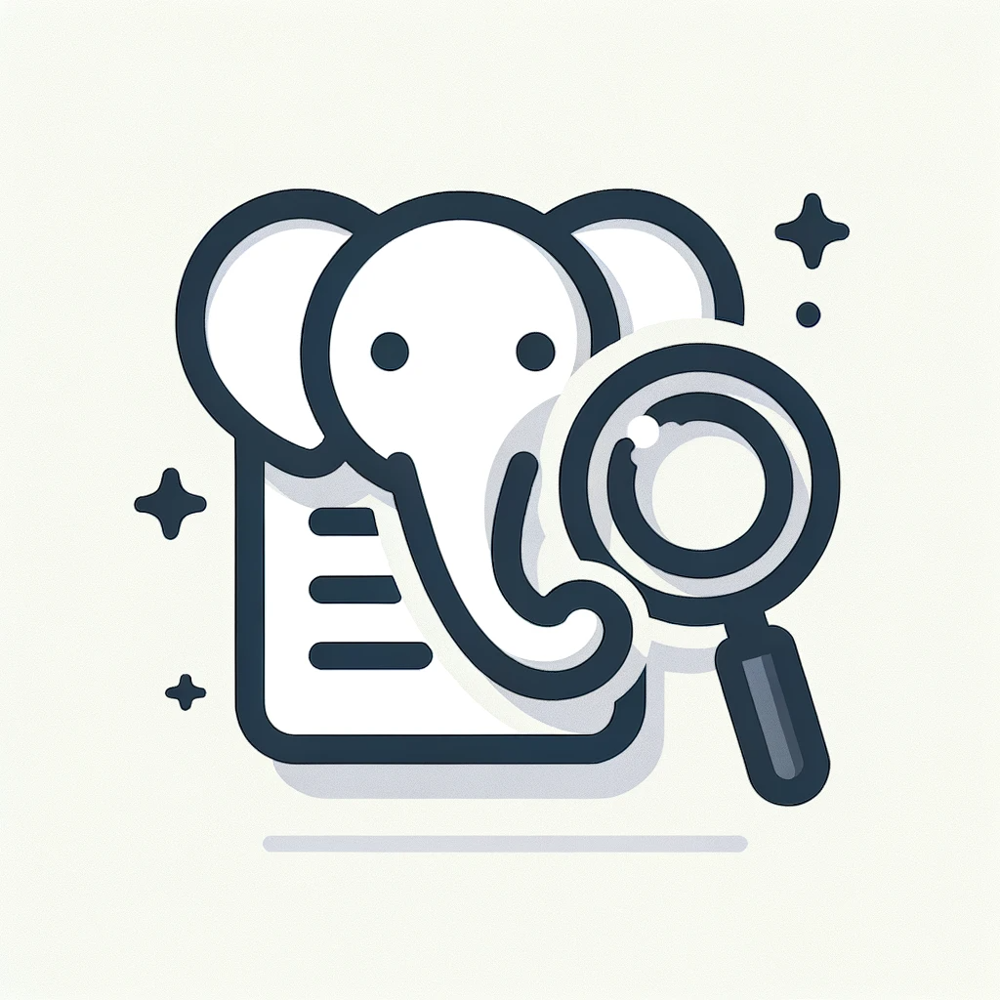
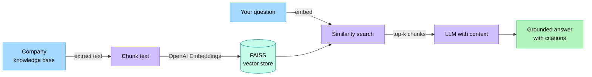
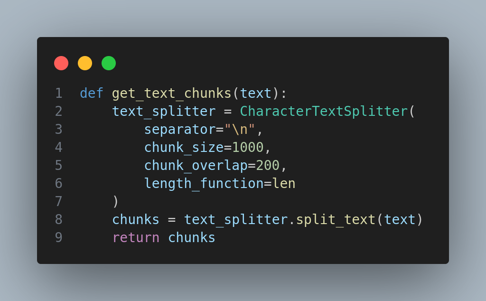

<!--
  Banner generated by capsule-render. Tweak via the URL parameters.
  https://capsule-render.vercel.app/api
-->
<p align="center">
  
</p>

<p align="center">
  
  
  
  
  
  
  
  
</p>

<p align="center">
  <b>An AI that knows your company's documents.</b><br/>
  Point it at your SOPs, policies, contracts, and playbooks. Ask anything. Get grounded answers from the source, with citations.
</p>

<p align="center">
  
</p>

---

## Why it exists

Generic AI is a *well-read stranger*. It knows the internet, not your company.

Every team has the same problem: critical knowledge sits in PDFs, wikis, contracts, and onboarding decks that no one has time to read. New hires ask their managers the same questions every quarter. Sales reps quote the wrong pricing. Support escalates issues that are already answered in the runbook.

QueryPDF demonstrates the pattern that fixes this: **ground an LLM in the company's own knowledge base** so answers come from the source material, not the model's training data.

Build it once, and the AI behaves like a colleague who has read everything your company has ever written.

---

## Use cases

| Department | The question | The source |
|---|---|---|
| Customer support | "What's our refund policy for enterprise plans?" | Terms of service, contract templates |
| Sales | "Has this prospect's industry been in our case studies?" | Case study library |
| Onboarding | "How do I request access to the production database?" | Internal runbooks, IT policies |
| Operations | "What's the procedure when a kiosk fails commissioning?" | Field SOPs |
| Legal / compliance | "What's our policy on data residency in the EU?" | Compliance handbook |

Same pattern, different documents.

---

## How it works



**The flow:**

1. **Ingest the knowledge base.** The app extracts text from your documents (PDFs in this reference build; the same pattern works for Notion exports, Confluence dumps, contract folders).
2. **Chunk and embed.** Text is split into manageable chunks, then each chunk is converted to a vector with OpenAI Embeddings.
3. **Index in FAISS.** Vectors go into a local FAISS index for fast similarity search.
4. **Query.** A user's question is embedded, FAISS returns the top-k most relevant chunks, and those chunks become context for the LLM.
5. **Answer.** The LLM responds using only the retrieved context. Conversation memory keeps follow-ups coherent.

---

## Tech stack

| Layer | Tool |
|---|---|
| UI | Streamlit |
| Orchestration | LangChain |
| Embeddings | OpenAI Embeddings |
| Vector store | FAISS (local, in-memory) |
| Container | Docker |

---

## Quick start

> Requires Docker and an OpenAI API key.

```bash
# 1. Clone
git clone https://github.com/19bk/QueryPDF_using_AI.git
cd QueryPDF_using_AI

# 2. Set your API key
cp .env.example .env
# Edit .env and set OPENAI_API_KEY

# 3. Build and run
docker build -t querypdf .
docker run --env-file .env -p 8501:8501 querypdf
```

Open <http://localhost:8501>, upload your documents, and start asking questions.

---

## Terminal quick-start

<p align="center">
  
</p>

> The GIF is regenerated from [`demo/quickstart.tape`](demo/quickstart.tape) using [VHS](https://github.com/charmbracelet/vhs). See [`demo/README.md`](demo/README.md) for details.

---

## Project structure

```
QueryPDF_using_AI/
├── src/              # Application source
├── static/           # README screenshots
├── demo/             # VHS terminal demo (.tape -> GIF)
├── Dockerfile        # Container build
├── requirements.txt  # Python dependencies
├── .env.example      # Environment template
└── README.md
```

---

## When to use this pattern

RAG over a company knowledge base is the right approach when:

- The answers must come from documents the company controls (policies, manuals, SOPs, contracts).
- The knowledge base changes often — too often to fine-tune a model against.
- Users need citations they can verify.
- The AI must not invent information that is not in the source material.
- The team wants to scale knowledge access without scaling headcount.

---

## Screenshots

<p align="center">
  
</p>

---

## License

MIT. See [LICENSE](LICENSE).

---

<p align="center">
  Built by <a href="https://github.com/19bk">Bernard Kibathi</a> — AI &amp; Automation Engineer<br/>
  <a href="https://dev.to/bernardkibathi">Dev.to</a> ·
  <a href="https://linkedin.com/in/bernard-kibathi">LinkedIn</a> ·
  <a href="https://github.com/19bk">GitHub</a>
</p>

<p align="center">
  
</p>
